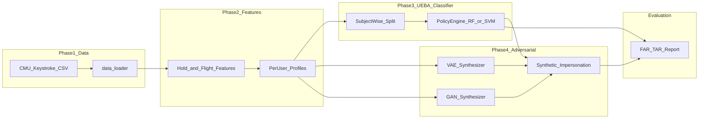
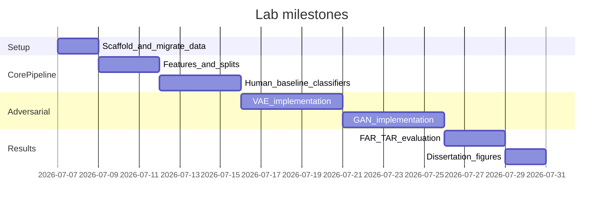

# Dissertation Lab Implementation Plan

## Research objective (from proposal)

Quantify how resilient UEBA-style behavioral biometric classifiers are when attacked by **AI-synthesized keystroke impersonation** — i.e., can a Policy Engine trained only on human telemetry still distinguish authorized users from generative-AI mimicry?

**Core evaluation metrics:** False Acceptance Rate (FAR) and True Acceptance Rate (TAR) when synthetic samples impersonate authorized users.

---

## Current baseline


| Asset                                                                                                                                        | Status                                                                                           |
| -------------------------------------------------------------------------------------------------------------------------------------------- | ------------------------------------------------------------------------------------------------ |
| `[Dessertation_Cs/](/Users/benjamin/Desktop/Projects/ML/Dessertation_Cs)`                                                                    | Empty — target workspace                                                                         |
| `[Dessertation_Research/venv/dataset_download.ipynb](/Users/benjamin/Desktop/Projects/ML/Dessertation_Research/venv/dataset_download.ipynb)` | CMU download + load + one hold-time plot for `s002`                                              |
| `[DSL-StrongPasswordData.csv](/Users/benjamin/Desktop/Projects/ML/Dessertation_Research/venv/DSL-StrongPasswordData.csv)`                    | 20,400 rows, 51 subjects, 34 timing columns (`H.*`, `DD.*`, `UD.*`)                              |
| ML stack                                                                                                                                     | pandas, scikit-learn, matplotlib in Python 3.14 venv — **no PyTorch yet** (required for VAE/GAN) |


**Decision (confirmed):** Build fresh in `Dessertation_Cs`; migrate dataset and notebook content out of `venv/`. Implement **both VAE and GAN** and compare attack effectiveness.

---

## End-to-end architecture




---

## Recommended project layout

```
Dessertation_Cs/
├── README.md
├── requirements.txt
├── .gitignore
├── data/
│   └── raw/DSL-StrongPasswordData.csv          # migrated, gitignored if large
├── notebooks/
│   ├── 01_data_exploration.ipynb               # migrated EDA
│   ├── 02_feature_engineering.ipynb
│   ├── 03_classifier_baseline.ipynb
│   └── 04_adversarial_evaluation.ipynb
├── src/
│   ├── config.py                               # paths, hyperparams, random seeds
│   ├── data/
│   │   ├── loader.py                           # load CMU CSV, subject filtering
│   │   └── splits.py                           # subject-wise train/val/test
│   ├── features/
│   │   └── keystroke.py                        # hold time, flight time extraction
│   ├── models/
│   │   ├── classifier.py                       # RF + SVM wrappers (Policy Engine)
│   │   ├── vae.py                              # per-user VAE for keystroke vectors
│   │   └── gan.py                              # per-user GAN alternative
│   ├── adversarial/
│   │   └── synthesize.py                       # generate impersonation samples
│   └── evaluation/
│       └── metrics.py                          # FAR, TAR, EER (supporting metric)
├── scripts/
│   └── run_experiment.py                       # end-to-end CLI
└── results/
    ├── models/                                 # saved PE + generative models
    ├── synthetic/                              # generated attack samples
    └── figures/                                # dissertation plots
```

---

## Phase 1 — Data acquisition

**Dataset:** CMU Keystroke Dynamics Lab `[DSL-StrongPasswordData.csv](https://www.cs.cmu.edu/~keystroke/DSL-StrongPasswordData.csv)` (already matches proposal; Buffalo dataset optional extension later).

**Tasks:**

1. Migrate CSV from `Dessertation_Research/venv/` → `Dessertation_Cs/data/raw/`.
2. Implement `[src/data/loader.py](src/data/loader.py)`:
  - Load CSV; validate 51 subjects × ~400 reps each.
  - Expose per-subject DataFrames keyed by `subject` (`s002`–`s051`).
  - Document password task context (fixed strong password → comparable key sequence across users).
3. Recreate and extend EDA in `[notebooks/01_data_exploration.ipynb](notebooks/01_data_exploration.ipynb)`:
  - Hold-time distributions per subject.
  - Inter-key latency (DD/UD) distributions.
  - Session/repetition variance (supports "continuous monitoring" narrative).

**Deliverable:** Clean, documented human baseline dataset ready for per-user modeling.

---

## Phase 2 — Feature engineering

Align with proposal terminology and CMU column naming:


| Proposal term | CMU columns      | Definition                                                                                                             |
| ------------- | ---------------- | ---------------------------------------------------------------------------------------------------------------------- |
| Hold Time     | `H.*`            | Duration key is pressed                                                                                                |
| Flight Time   | `DD.*` or `UD.*` | Interval between consecutive keystrokes (use **DD** as primary flight time; keep UD as optional secondary feature set) |


**Tasks:**

1. Implement `[src/features/keystroke.py](src/features/keystroke.py)`:
  - Flatten each typing repetition into a fixed-length feature vector (31 timing dims from password keys, excluding metadata cols).
  - Optional aggregated stats per rep: mean/std of hold and flight times (reduces dimensionality for simpler baselines).
2. Build per-user behavioral profiles:
  - **Enrollment set:** early sessions/reps for baseline (e.g., sessions 1–4).
  - **Verification set:** held-out human reps for TAR measurement.
3. Implement subject-wise splitting in `[src/data/splits.py](src/data/splits.py)` — **never mix another subject's samples into a user's enrollment** (prevents optimistic bias).

**Deliverable:** `(X_enroll, X_verify, y)` tensors per subject, reproducible via seed in `[src/config.py](src/config.py)`.

---

## Phase 3 — UEBA classifier (Policy Engine)

Frame the classifier as a **per-user binary authenticator** mirroring ZT continuous verification:

- **Positive class:** authorized user's human keystrokes.
- **Negative class:** all other subjects' human keystrokes (impostor set) *or* one-class anomaly detection variant.

**Recommended primary setup (matches adversarial test design):**

- Train PE **only on target user's human enrollment data** plus human impostor negatives.
- Reserve all synthetic samples strictly for Phase 4 testing (as proposal specifies).

**Models (implement both, compare in results):**

1. **Random Forest** — strong baseline on tabular timing features; interpretable feature importances for dissertation discussion.
2. **SVM (RBF kernel)** — aligns with proposal and your existing `[SVM suppl.ipynb](/Users/benjamin/Desktop/Projects/ML/SVM suppl.ipynb)` knowledge.

**Tasks:**

1. `[src/models/classifier.py](src/models/classifier.py)`: sklearn pipelines with `StandardScaler` + classifier; save/load via joblib.
2. Hyperparameter tuning on validation split (GridSearchCV or RandomizedSearchCV): `C`/`gamma` for SVM; `n_estimators`/`max_depth` for RF.
3. Human-only baseline metrics in `[notebooks/03_classifier_baseline.ipynb](notebooks/03_classifier_baseline.ipynb)`:
  - TAR on genuine verification reps.
  - FAR on human impostor attempts.
  - Equal Error Rate (EER) as supplementary metric (standard in biometrics literature).

**Deliverable:** Trained Policy Engine per user (or pooled multi-user model if simpler MVP first), with human-only performance table.

---

## Phase 4 — Adversarial synthesis (VAE + GAN)

Train generative models **per authorized user** on enrollment keystroke vectors to mimic that user's rhythm distribution.

### VAE (proposal-primary rationale: models distribution, not memorization)

- Architecture: MLP encoder/decoder on 31-dim timing vectors (PyTorch).
- Loss: reconstruction (MSE) + KL divergence.
- Generate synthetic reps by sampling latent `z ~ N(0,I)` and decoding.
- Train one VAE per target user on enrollment data only.

### GAN (proposal-secondary: captures non-linear relationships)

- Architecture: MLP Generator + Discriminator on same feature vectors.
- Use WGAN-GP or standard GAN with gradient penalty for training stability on small per-user sample counts (~200–400 reps).
- Train one GAN per target user.

**Tasks:**

1. Add PyTorch to `[requirements.txt](requirements.txt)` (`torch`, optionally `tensorboard` for loss curves).
2. Implement `[src/models/vae.py](src/models/vae.py)` and `[src/models/gan.py](src/models/gan.py)` with shared training loop utilities.
3. `[src/adversarial/synthesize.py](src/adversarial/synthesize.py)`:
  - Generate N synthetic impersonation samples per user per model.
  - Post-process: clip negative timings to 0; optionally match per-user mean/variance (light refinement, not required initially).
4. **Critical experimental constraint:** generative models never see PE test data; PE never trains on synthetic samples.

**Deliverable:** Two attack pipelines (VAE-impersonation, GAN-impersonation) producing saved synthetic CSVs in `results/synthetic/`.

---

## Evaluation — FAR & TAR under impersonation


| Metric           | Definition in this lab                                                                           |
| ---------------- | ------------------------------------------------------------------------------------------------ |
| **TAR**          | Fraction of genuine human verification samples accepted by PE                                    |
| **FAR (attack)** | Fraction of **AI-synthesized** impersonation samples incorrectly accepted as the authorized user |


**Tasks:**

1. `[src/evaluation/metrics.py](src/evaluation/metrics.py)`: compute TAR, FAR, EER; aggregate per user and mean ± std across 51 subjects.
2. `[notebooks/04_adversarial_evaluation.ipynb](notebooks/04_adversarial_evaluation.ipynb)` + `[scripts/run_experiment.py](scripts/run_experiment.py)`:
  - Compare: Human impostor FAR vs VAE FAR vs GAN FAR.
  - Plot: FAR comparison bar chart (VAE vs GAN vs human baseline).
  - Table: TAR degradation when threshold tuned for human-only EER.
3. Optional sensitivity analysis: number of enrollment samples vs attack success (strengthens dissertation discussion).

**Primary research output:** empirical evidence quantifying the proposal's "trust paradox" — e.g., "VAE/GAN impersonation raised FAR from X% (human impostors) to Y% (synthetic)."

---

## Environment & reproducibility

**New venv in `Dessertation_Cs`** (do not reuse `venv/` as project root):

```
python -m venv .venv && source .venv/bin/activate
pip install pandas numpy scikit-learn matplotlib seaborn jupyter torch joblib
pip freeze > requirements.txt
```

**Also add:**

- `[.gitignore](.gitignore)`: `.venv/`, `data/raw/*.csv`, `results/`, `__pycache__/`, `.ipynb_checkpoints/`
- `[README.md](README.md)`: research question, dataset citation, how to run `scripts/run_experiment.py`
- Fixed random seeds (`numpy`, `sklearn`, `torch`) in `config.py`
- Initialize git repo (optional but recommended for dissertation versioning)

---

## Suggested implementation order (milestones)




| Milestone           | Exit criteria                                            |
| ------------------- | -------------------------------------------------------- |
| M1 — Scaffold       | Project layout, migrated CSV, EDA notebook runs          |
| M2 — Features       | Per-user feature matrices + splits reproducible          |
| M3 — Human baseline | RF & SVM human TAR/FAR table for all subjects            |
| M4 — VAE attacks    | VAE trained per user; synthetic samples generated        |
| M5 — GAN attacks    | GAN trained per user; comparison data ready              |
| M6 — Evaluation     | FAR/TAR report: human vs VAE vs GAN                      |
| M7 — Figures        | Publication-ready plots for dissertation Results chapter |


---

## Risks and mitigations


| Risk                                                                   | Mitigation                                                                            |
| ---------------------------------------------------------------------- | ------------------------------------------------------------------------------------- |
| Small per-user sample size (~400 reps) limits GAN stability            | Start with VAE; use WGAN-GP + early stopping; data augmentation via session averaging |
| Raw timing vectors are noisy                                           | Offer aggregated feature mode (mean hold/flight per key) as ablation                  |
| CMU password is fixed-length — good for vectors, limits generalization | Document as controlled lab setting; note Buffalo dataset as future work               |
| Python 3.14 + PyTorch compatibility                                    | Verify `torch` install on first setup; fall back to Python 3.11/3.12 if needed        |
| Training 51 × 2 generative models is slow                              | MVP on 5–10 representative subjects first; scale to full cohort for final results     |


---

## Dissertation alignment checklist

- [ ] Phase 1: CMU keystroke acquisition — **partially done**, migrate + document
- [ ] Phase 2: Hold Time + Flight Time feature engineering
- [ ] Phase 3: RF/SVM Policy Engine trained on human data only
- [ ] Phase 4: VAE + GAN synthetic impersonation (strictly held-out from PE training)
- [ ] Evaluation: FAR and TAR quantifying ZT/UEBA resilience gap
- [ ] Narrative hook: results feed directly into "Verify Explicitly" vulnerability discussion (Xu et al. 2025 vs Roy et al. 2025)